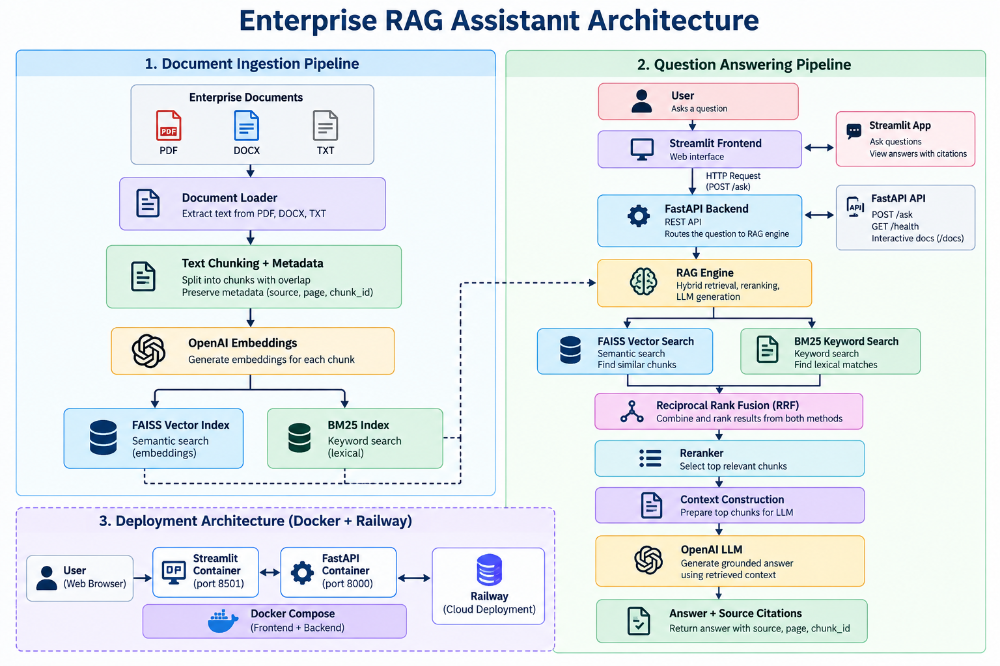

# Enterprise RAG Assistant

A production-oriented **Retrieval-Augmented Generation (RAG)** application for answering questions from enterprise documents using hybrid retrieval, reranking, grounded LLM generation, and source citations.

The system combines **FAISS semantic search** and **BM25 keyword search**, fuses retrieval results using **Reciprocal Rank Fusion (RRF)**, reranks candidate chunks, and sends the most relevant context to an LLM to generate grounded answers.

The application includes a **FastAPI backend**, **Streamlit frontend**, automated tests, Docker containerization, and cloud deployment on Railway.

---

## Features

- Multi-format document ingestion
  - PDF
  - DOCX
  - TXT
- Text extraction and preprocessing
- Configurable text chunking with overlap
- Metadata preservation
- OpenAI embeddings
- FAISS vector search
- BM25 keyword search
- Hybrid retrieval
- Reciprocal Rank Fusion (RRF)
- Candidate retrieval and reranking
- Context selection
- Grounded LLM answer generation
- Source citations
- Chunk-level traceability
- Unknown-question handling
- Saved vector-store support
- FastAPI REST API
- Streamlit web interface
- Docker containerization
- Docker Compose orchestration
- Health checks
- Environment-based configuration
- Automated testing with pytest
- Railway cloud deployment

---

## Why Hybrid RAG?

Vector search is useful for finding documents with similar **semantic meaning**, while BM25 is effective for **exact keywords, identifiers, policy numbers, and terminology**.

Instead of depending on only one retrieval method, this project combines both.

```text
Semantic Search (FAISS)
          +
Keyword Search (BM25)
          ↓
Reciprocal Rank Fusion
          ↓
Better Candidate Retrieval
```

This provides a stronger retrieval pipeline for enterprise documents containing both natural-language concepts and exact business terminology.

---

## Architecture



### Document Ingestion Pipeline

```text
PDF / DOCX / TXT
       ↓
Document Loader
       ↓
Text Extraction
       ↓
Chunking + Overlap
       ↓
Metadata
       ↓
Embeddings
       ↓
FAISS Vector Index

Chunks
  ↓
BM25 Keyword Index
```

### Question Answering Pipeline

```text
                    User Question
                         ↓
                 Query Processing
                         ↓
              ┌──────────┴──────────┐
              ↓                     ↓
       FAISS Vector Search      BM25 Search
       (Semantic Search)      (Keyword Search)
              ↓                     ↓
              └──────────┬──────────┘
                         ↓
            Reciprocal Rank Fusion
                       (RRF)
                         ↓
                 Candidate Chunks
                         ↓
                     Reranker
                         ↓
                   Top Chunks
                         ↓
                Context Construction
                         ↓
                        LLM
                         ↓
              Grounded Answer
                         +
                  Source Citations
```

---

## RAG Pipeline

The complete RAG workflow implemented in this project is:

```text
Load Documents
      ↓
Extract Text
      ↓
Chunk Documents
      ↓
Generate Embeddings
      ↓
Build FAISS Index
      ↓
Build BM25 Index
      ↓
User Query
      ↓
FAISS Search + BM25 Search
      ↓
RRF Fusion
      ↓
Candidate Retrieval
      ↓
Reranking
      ↓
Select Top Context
      ↓
LLM Generation
      ↓
Answer + Citations
```

---

## Retrieval Strategy

### 1. Semantic Retrieval

Document chunks are converted into vector embeddings.

FAISS searches the vector index to retrieve chunks that are semantically similar to the user's question.

This helps when the question and document express the same concept using different words.

### 2. Keyword Retrieval

BM25 performs lexical retrieval based on keywords and term importance.

This is useful for queries containing:

- Policy identifiers
- Technical terminology
- Product names
- Exact phrases
- Acronyms
- Numbers

### 3. Reciprocal Rank Fusion

Results from FAISS and BM25 are combined using **Reciprocal Rank Fusion (RRF)**.

Conceptually:

```text
RRF Score = Σ 1 / (k + rank)
```

Documents that rank highly across retrieval methods receive stronger combined scores.

### 4. Reranking

Hybrid retrieval intentionally returns more candidate chunks than are ultimately sent to the LLM.

For example:

```text
Hybrid Retrieval
      ↓
Top 15 candidates
      ↓
Reranker
      ↓
Top 5 chunks
      ↓
LLM
```

This improves context quality while reducing unnecessary LLM context usage.

---

## Source Citations

Answers include metadata identifying the source used to generate the response.

Example:

```json
{
  "question": "How many days per week can employees work remotely?",
  "answer": "Employees can work remotely up to three days per week.",
  "citations": [
    {
      "source": "remote_work_policy.txt",
      "page": null,
      "chunk_id": 0
    }
  ]
}
```

This provides traceability between generated answers and retrieved enterprise documents.

---

## Hallucination Reduction

The generation layer is designed to answer using retrieved document context rather than relying only on the LLM's internal knowledge.

When sufficient supporting information is unavailable, the system is designed to avoid inventing unsupported information.

This makes the architecture more appropriate for enterprise knowledge-assistant use cases.

---

## Tech Stack

### Language

- Python 3.12

### RAG / AI

- OpenAI API
- OpenAI Embeddings
- FAISS
- BM25
- Reciprocal Rank Fusion
- Reranking

### Backend

- FastAPI
- Uvicorn

### Frontend

- Streamlit

### Document Processing

- PDF parsing
- DOCX parsing
- TXT processing

### Testing

- pytest

### Environment & Dependency Management

- uv
- python-dotenv

### DevOps

- Docker
- Docker Compose

### Deployment

- Railway
- GitHub

---

## Project Structure

```text
enterprise-rag-assistant/
│
├── data/
│
├── frontend/
│   └── app.py
│
├── src/
│   └── enterprise_rag/
│       ├── __init__.py
│       │
│       ├── api/
│       │
│       ├── core/
│       │
│       ├── embeddings/
│       │
│       ├── generation/
│       │
│       ├── ingestion/
│       │
│       └── retrieval/
│
├── tests/
│   ├── test_chunker.py
│   ├── test_document_loader.py
│   └── test_ingestion.py
│
├── .dockerignore
├── .gitignore
├── Dockerfile
├── compose.yaml
├── pyproject.toml
├── requirements.txt
└── README.md
```

---

## Installation

### 1. Clone the Repository

```bash
git clone https://github.com/nakkaganesh/enterprise-rag-assistant.git
cd enterprise-rag-assistant
```

### 2. Install uv

If `uv` is not already installed, install it using the official uv installation instructions.

### 3. Install Dependencies

```bash
uv sync
```

### 4. Configure Environment Variables

Create a `.env` file in the project root.

```text
OPENAI_API_KEY=your_openai_api_key
```

Never commit `.env` or API credentials to GitHub.

---

## Run Locally

### Backend

Start the FastAPI application:

```bash
uv run uvicorn enterprise_rag.api.main:app --host 0.0.0.0 --port 8000
```

Backend:

```text
http://localhost:8000
```

Health endpoint:

```text
http://localhost:8000/health
```

FastAPI Swagger documentation:

```text
http://localhost:8000/docs
```

### Frontend

In another terminal:

```bash
uv run streamlit run frontend/app.py
```

Then open:

```text
http://localhost:8501
```

---

## Run with Docker

Build and start the complete application:

```bash
docker compose up --build
```

Or run it in detached mode:

```bash
docker compose up --build -d
```

Check running services:

```bash
docker compose ps
```

The application exposes:

```text
FastAPI Backend
http://localhost:8000

Streamlit Frontend
http://localhost:8501
```

Stop the application:

```bash
docker compose down
```

---

## Docker Architecture

```text
Browser
   ↓
Streamlit Container
   ↓
FastAPI Container
   ↓
RAG Engine
   ↓
FAISS + BM25
   ↓
RRF
   ↓
Reranker
   ↓
LLM
   ↓
Answer + Citations
```

Docker Compose manages the frontend and backend services together for local development.

---

## API

### Health Check

```http
GET /health
```

Example response:

```json
{
  "status": "ok"
}
```

### Ask a Question

```http
POST /ask
```

Example request:

```json
{
  "question": "How many days per week can employees work remotely?"
}
```

Example response:

```json
{
  "question": "How many days per week can employees work remotely?",
  "answer": "Employees can work remotely up to three days per week.",
  "citations": [
    {
      "source": "remote_work_policy.txt",
      "page": null,
      "chunk_id": 0
    }
  ]
}
```

---

## Testing

Run the automated test suite:

```bash
uv run python -m pytest
```

Current verified result:

```text
4 passed
```

The currently collected automated tests cover core document-processing functionality including:

- Document loading
- Text chunking
- Document ingestion

The deployed application has also been manually tested end-to-end for:

- Streamlit-to-FastAPI communication
- Document retrieval
- Hybrid search
- RRF
- Reranking
- LLM answer generation
- Source citations
- Unknown-question handling
- Docker deployment
- Railway deployment

---

## Production Deployment

The application is deployed using **Railway**.

The production architecture separates the frontend and backend:

```text
User
 ↓
Public Streamlit Service
 ↓
API_URL
 ↓
FastAPI Service
 ↓
RAG Engine
 ↓
FAISS + BM25
 ↓
RRF
 ↓
Reranker
 ↓
LLM
 ↓
Answer + Citations
```

The frontend receives the backend URL through an environment variable:

```text
API_URL=<FASTAPI_BACKEND_URL>
```

The OpenAI API key is stored as a deployment environment variable rather than being embedded in source code.

---

## Security

Sensitive credentials are managed through environment variables.

The `.env` file is excluded from version control.

```text
.env
```

API keys should never be stored directly in:

- Python source files
- Dockerfiles
- README files
- Git commits
- Public deployment configuration
- Screenshots

---

## Example Use Cases

The architecture can be adapted for:

- Employee policy assistants
- HR knowledge bases
- Internal company documentation
- Security-policy assistants
- Technical documentation search
- Customer-support knowledge bases
- Compliance document search
- Enterprise knowledge management

---

## Key Engineering Concepts Demonstrated

This project demonstrates practical understanding of:

- Retrieval-Augmented Generation
- Embeddings
- Vector databases
- Semantic search
- Keyword search
- Hybrid retrieval
- Reciprocal Rank Fusion
- Reranking
- Context-window optimization
- Prompt grounding
- Hallucination reduction
- Source attribution
- REST API development
- Frontend/backend architecture
- Containerization
- Environment management
- Automated testing
- Cloud deployment

---

## Future Improvements

Potential production improvements include:

- Persistent cloud storage for uploaded documents and indexes
- Authentication and authorization
- User-specific document collections
- PostgreSQL metadata storage
- Object storage
- Incremental document indexing
- Document deletion and index synchronization
- Retrieval evaluation using Recall@K and MRR
- Larger automated RAG evaluation dataset
- LLM-based evaluation
- Observability and tracing
- Request logging
- Rate limiting
- Caching
- CI/CD with GitHub Actions
- Background ingestion workers
- Production monitoring
- Multi-user support

---

## Development Status

Core RAG pipeline: **Completed**

Hybrid retrieval: **Completed**

RRF fusion: **Completed**

Reranking: **Completed**

Source citations: **Completed**

FastAPI backend: **Completed**

Streamlit frontend: **Completed**

Dockerization: **Completed**

Railway deployment: **Completed**

Production-grade persistent cloud storage: **Future improvement**

---

## Author

**Nakka Ganesh**

AI / Machine Learning Developer

GitHub: `nakkaganesh`

---

## License

This project is intended for educational, portfolio, and demonstration purposes.